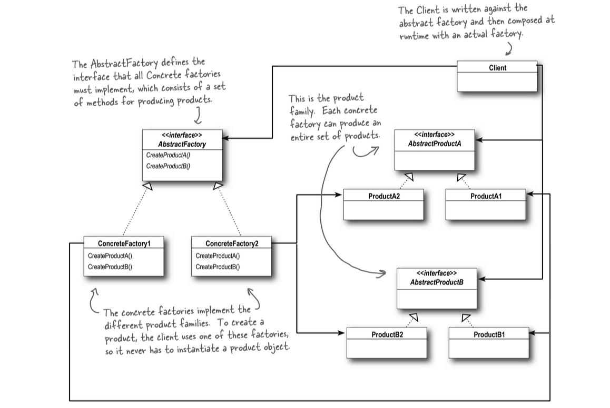

## Abstract Factory Pattern
- The Abstract Factory Pattern provides an interface for creating families of related
    or dependent objects without specifying their concrete classes.
- **Key Concept**: Abstract Factory creates related products through an abstract interface
- **Client Benefit**: Clients use products without knowing concrete implementations
- **Design Advantage**: Decoupling between client code and product specifics
- **Application**: Useful when system needs to work with multiple families of related products

