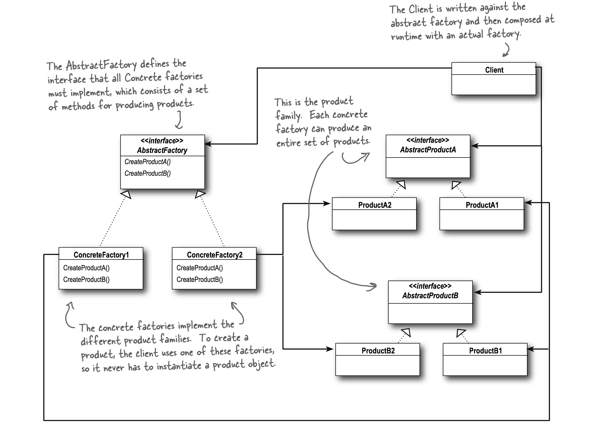
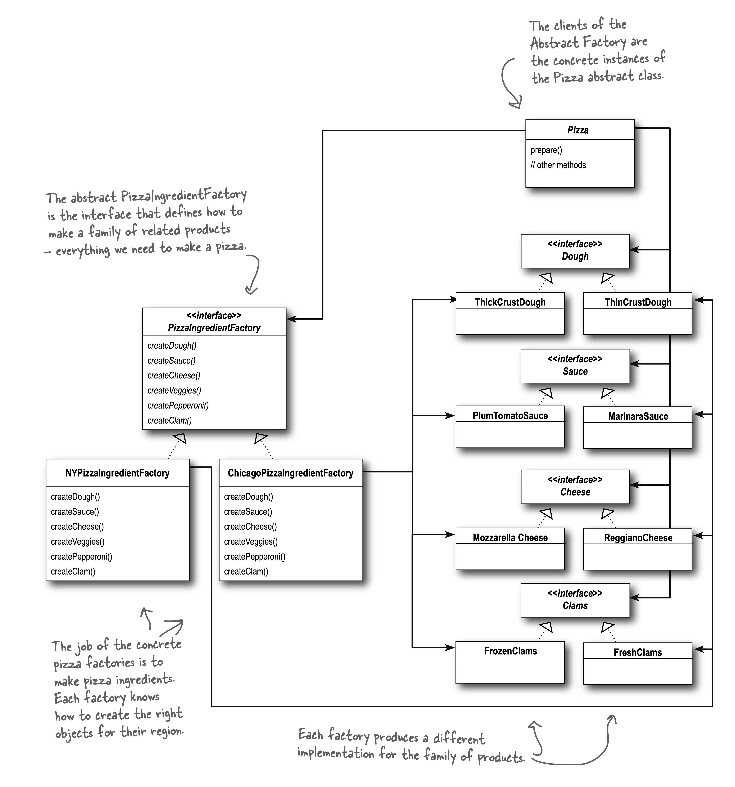
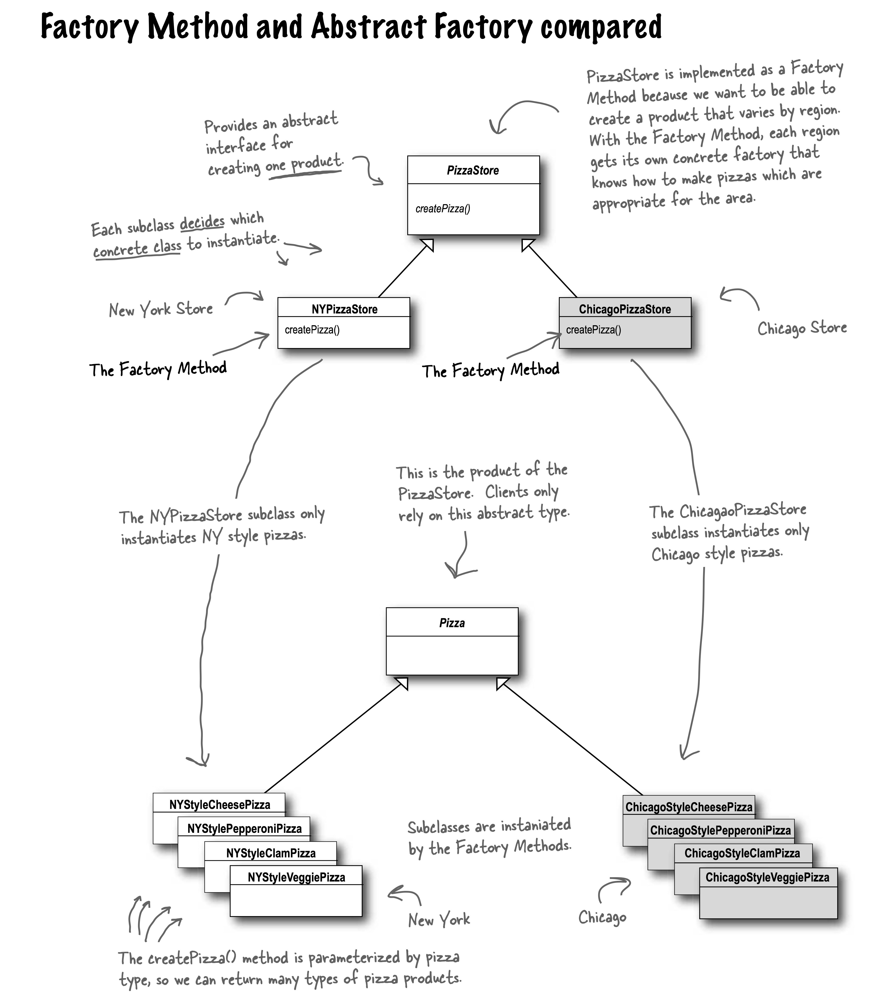
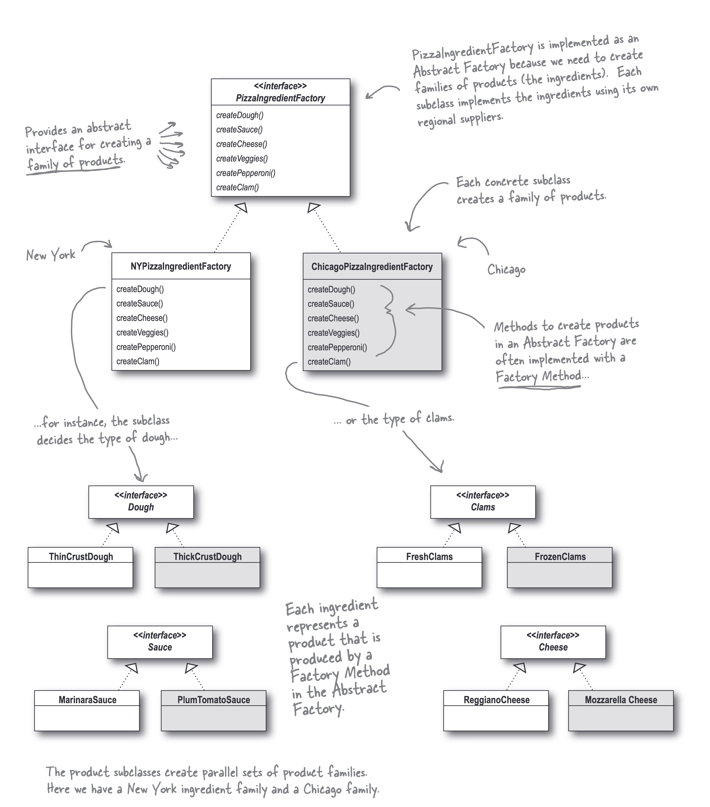

## Abstract Factory Pattern
- The Abstract Factory Pattern provides an interface for creating families of related
    or dependent objects without specifying their concrete classes.
- **Key Concept**: Abstract Factory creates related products through an abstract interface
- **Client Benefit**: Clients use products without knowing concrete implementations
- **Design Advantage**: Decoupling between client code and product specifics
- **Application**: Useful when system needs to work with multiple families of related products

## Pizza Store Example

## Difference between Factory Method Pattern and Abstract Factory Pattern

|                | Factory Method Pattern                                                               | Abstract Factory Pattern                                                                    |
|----------------|--------------------------------------------------------------------------------------|---------------------------------------------------------------------------------------------|
| Purpose        | Creates one specific product                                                         | Creates entire families of related products                                                 |
| Implementation | Uses inheritance, a subclass decides which object to create via an overridden method | Uses composition, a separate factory object handles creation, and we pass it to client code |
| Flexibility    | Less flexible, as it creates only one type of object                                 | More flexible, as it creates multiple types of objects                                      |
| Use Case       | When we need to create one type of object                                            | When we need to create multiple types of objects                                            |