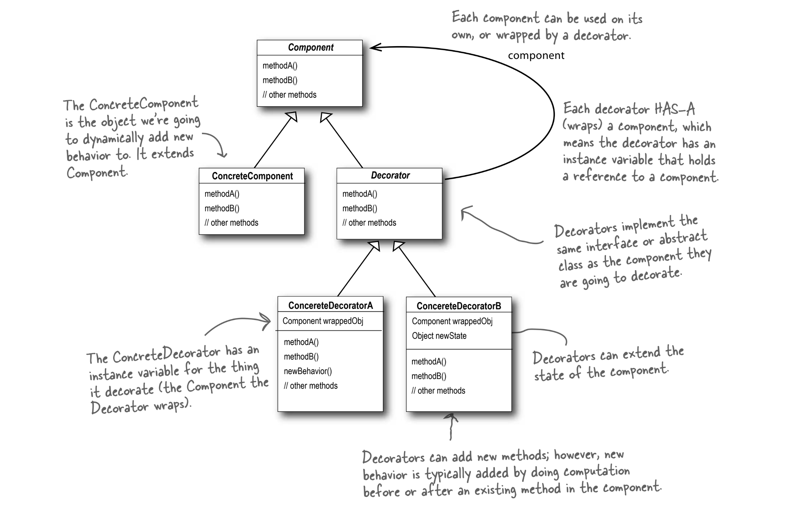
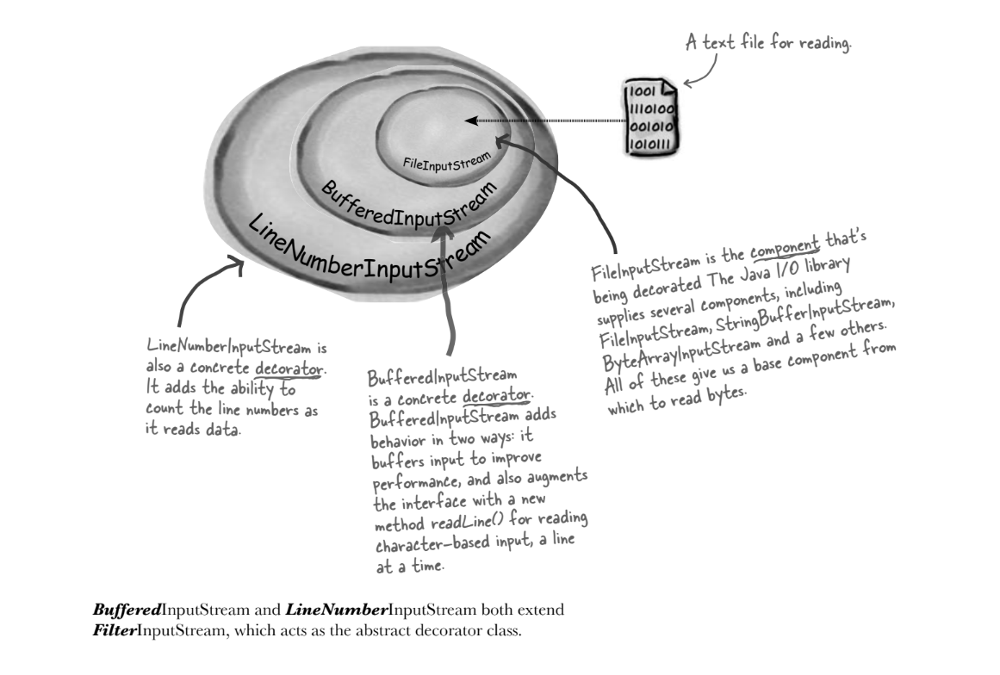
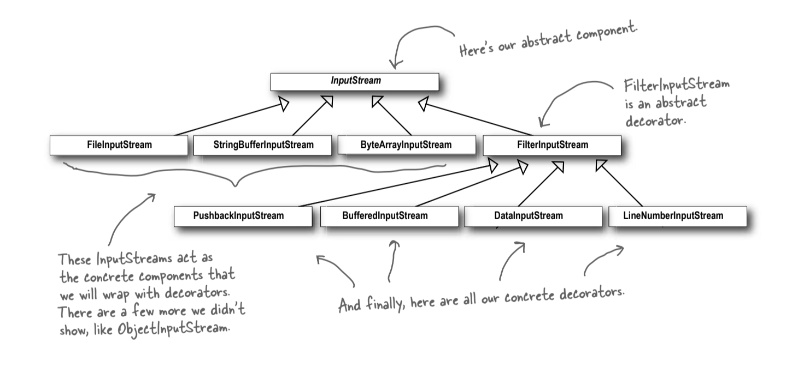

## The Decorator Pattern

- This pattern allows adding new behaviors to objects dynamically by placing them inside special wrapper objects called decorators.
- It is particularly useful for adding new functionality to an object without modifying its structure, adhering to the Open-Closed Principle.
- **Purpose**: To extend the functionality of classes without modifying their existing code.
- **Use Cases**: Ideal for adding optional features or behaviors at runtime, avoiding subclass explosion, and adhering
  to the Open-Closed Principle.

## Key Components

- **Component**: The base interface or class that defines the common operations.
- **Concrete Component**: A specific implementation of the component.
- **Decorator**: An abstract class that implements the component interface and contains a reference to the component.
- **Concrete Decorator**: Specific decorators that add new behaviors to the component.



## Benefits

- **Flexibility**: Allows adding or removing behaviors dynamically at runtime.
- **Avoids Subclass Explosion**: Simplifies code by avoiding complex class hierarchies.
- **Adherence to Principles**: Supports the Single Responsibility Principle and Open-Closed Principle.
- **Reusability**: Decorators are modular and reusable.

## Trade-offs

- **Complexity**: Overuse can lead to complex code structures.
- **Performance Overhead**: Minor overhead due to method delegation.
- **Limited Support for Removing Decorators**: Removing decorators can be challenging.
- **Managing Decorator Chains**: When using the Decorator pattern, it's possible to accidentally reference an **intermediate decorator** instead of the **outermost decorator**. This can lead to incomplete behavior, as some decorators might be skipped in the final functionality.
  ```java
  Beverage beverage = new DarkRoast();
  beverage = new Mocha(beverage);
  beverage = new Soy(beverage);
  beverage = new Whip(beverage);
  
  // Somewhere in code:
  Beverage incorrectReference = new Soy(beverage); // Skips Whip!
  ```
- **Type Transparency**: Decorators create wrapper objects that hide the original concrete component type. Client code checking `instanceof ConcreteComponent` will fail after decoration.
  ```java
  Beverage order = new HouseBlend(); // Base component
  order = new Mocha(order); // Add decorator
  
  if (order instanceof HouseBlend) { // Returns FALSE
    applyDiscount(); // Discount never applies!
  }
  ```

## Real-World Applications

- **Java I/O API**: Uses decorators like `BufferedReader` to enhance `FileReader`.
- **Product Customization**: E-commerce platforms use decorators for product options.
- **Streaming Services**: Decorators are used for playback options like subtitles.

## When to Use

- **Dynamic Behavior Addition**: When you need to add behaviors at runtime.
- **Avoiding Inheritance Complexity**: When subclassing would lead to a complex hierarchy.

## Java I/O API
- `java.io` package is largely based on Decorator.
- Set of objects that use decorators to add functionality to reading data from a file:
  
- InputStream Design:
  
